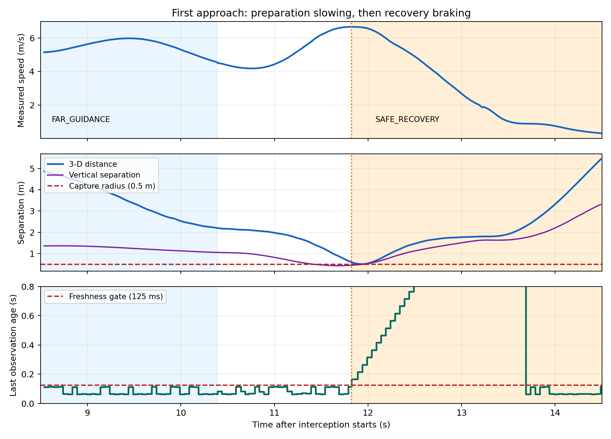

# 带噪 ToF 定位适配与第一次闭环复验

本报告对应末端连续执行修复**之前**的 `20261007_104013_014381`。带噪定位已接通，但任务仍为 **FAILURE / TIMEOUT**；不能登记为成功基线。完整原始证据见 [独立数据包](README.md)。

## 改动与边界

本阶段只适配红球的已知半径带噪球面定位，不改 KF、BCTRA、MINCO、tracker、任务状态机、海面保护或捕获半径。采用径向第一回波残差、鲁棒拟合、实际测量残差 P95 ≤ 3σ、独立漏交几何检查、同样本平面竞争检查和可观测性检查。平面竞争的代价差阈值 9 是工程门控，未标定为统计显著性检验。拟合最大轴一阶标准差进入输出协方差的保守下限。

理想深度模式保留原算法。真实 ToF 功能、未标定量程/噪声与红球识别边界见 [相机说明](../../../docs/current/camera_simulation.md)。本次保持 0.15 m / 0.25 Hz 升沉、仅前视和带噪深度；不读取真值作在线修正，不改写采集戳。

## 实际结果

- 完整启动一次，X 起飞/目标运动，连续 FOLLOW 3 s 后 Y 截击。Y 后 30.047 s 超时。
- 最近三维距离 **0.504192 m**，未进入原 **0.50 m** 捕获球。该时刻为 SAFE_RECOVERY，水平距离 0.103632 m、竖直间距 0.493426 m，海面状态为 SAFE。
- 截止结果时刻前共 846 条定位诊断：662 条无拒绝原因，64 条 IMAGE_INVALID、120 条 DEPTH_RATIO_LOW；无 TARGET_VECTOR_INVALID。可计算同采集时刻真值误差的有效样本为 660 条。无拒绝记录中的两条缺少有效真值匹配。
- 原始记录包含超时后继续运行的观测，完整保留；下表和控制分析均截止 `1791340855.4614508`，不混入后续记录。

| CSV 阶段 | 有效同刻样本 | 三维 RMSE | 三维误差 P95 | Z 轴 RMSE |
|---|---:|---:|---:|---:|
| PREPARATION（起飞/跟随/接近混合） | 579 | 0.368 m | 0.297 m | 0.078 m |
| TERMINAL_APPROACH | 32 | **0.092 m** | **0.104 m** | **0.059 m** |
| RECOVERY | 49 | 0.095 m | 0.139 m | 0.044 m |

PREPARATION 最大三维误差 3.387 m，不能称全程厘米精度。固定 FOLLOW 稳定窗口仅有 2 条有效同刻样本，不作稳态精度结论。这里是定位误差，尚不是未来位置预测误差；短时末端样本也不足以代表任意目标、距离和海况。

## 未接触即减速的证据

1. FAR_GUIDANCE 追踪为竖直下降预留距离的移动准备点，接近时实际水平速度从约 6.0 降至 4.2 m/s；这是当前准备阶段控制律。
2. 第一次末端重新加速至约 6.65 m/s。11.750 s 起出现连续 DEPTH_RATIO_LOW，11.823 s 有效观测年龄达 0.166 s，超过 0.125 s freshness，锁定失效并切入 SAFE_RECOVERY。恢复分支将水平目标速度设为零、限加速度刹车并爬升。最近距离发生在恢复之后，没有触发捕获。
3. 第二次 22.281 s 以 NO_VALID_PLAN 进入恢复。当时 KF 年龄 0.116 s，但 prediction 已失效；现有日志不能唯一确定预测失效的具体时延来源。

末端保速参数仍为 true。保速调用依赖有效感知和当前轨迹，失效恢复分支会覆盖它。第一次最后有效帧的球心相机距离约 0.528 m，球面深度中位数约 0.306 m，紧接着深度比例不足；0.25 m 的 ToF 近距限值是需要核查的因素。拒绝帧诊断中的像素数/比例为默认零，未记录原始图像，不能把这些默认零解释为实际红色像素消失或据此唯一确认盲区原因。



## Z 预测与检查

当前预测器考虑 KF 的 z/vz，但使用速度按 0.75 s 时间常数衰减的有限外推，并由最近 1 s 观测范围加 0.25 m 余量限幅；不估计周期升沉的幅值、频率或相位，不能显式预报 4 s 周期的峰谷和反向。尚未据此确定这次失败的全部竖直归因。

本阶段新增 18 项定位回归，包含 1–15 m 带噪球面、24 m 稀疏回波、裁剪球面、远距平面和错误深度混合拒绝。完整 pytest **877 passed / 1 skipped**，2 条已有依赖弃用警告；项目 flake8 和 4 包构建通过。141 个原有控制/预测/规划/任务/评价/测试/模型/补丁等受保护文件逐字节相同；运行前记录的 8 个源码/配置快照与实际源码相同。进程已清理。本次失败没有成功后冻结验收。

复算命令（输出写入新目录，不改证据）：

```bash
cd /home/qin/data/uav_usv_mpc
MPLCONFIGDIR=/tmp/uav_usv_mpl python3 \
  data/baselines/20261007_front_tof_fit_heave015_audit/run1/tools/analyze_recording.py \
  data/baselines/20261007_front_tof_fit_heave015_audit/run1 \
  data/experiments/current/tof_fit_reanalysis
```
