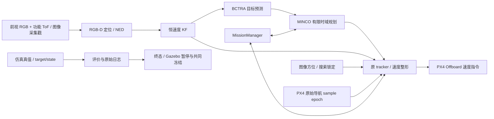

# 当前架构与控制边界

当前默认只有前视 RGB + 功能 ToF 输入，下视关闭；升沉幅值 0.15 m。传感器模型的假设、真机边界和恢复步骤见 [相机文档](camera_simulation.md)。

当前统一入口为 [modular_intercept.launch.py](../../src/uav_usv_bringup/launch/modular_intercept.launch.py)，参数为 [baseline.yaml](../../src/uav_usv_bringup/config/baseline.yaml)。它使用多个进程隔离感知、预测、规划、跟踪、任务和评价，tracker 是 PX4 指令的唯一在线发布者。

| 层 | 源码/接口 | 当前职责 |
|---|---|---|
| 感知 | `perception/`；`/perception/front/target_observation`、`target_position` | 红球图像方位、深度关联、姿态与坐标变换 |
| 跟踪 | `tracking/target_kalman_filter.py`；`/tracking/target_state` | KF 位置和速度；保持观测戳与 freshness |
| 预测 | `tracking/target_predictor_node.py`；`/planning/target_prediction` | 基于 KF 的 BCTRA；4.0 s 预测窗、0.1 s 样点 |
| 规划 | `guidance/intercept_planner_node.py`、`fast_minco_planner.py` | 常规 5 Hz、末端 10 Hz；最长 1.5 s，末端最短 0.30 s；异步生成/校验 |
| 控制 | `control/trajectory_tracker_node.py`、`trajectory_tracking.py` | 20 Hz 采样参考、自有位置反馈、限速/限加速度、海面保护 |
| 任务 | `mission/mission_manager_node.py` | X 起飞和 FOLLOW；Y 进近与截击；恢复、任务终态 |
| 评价 | `evaluation/intercept_evaluator_node.py` | 真值误差、0.50 m 捕获球、触海/超时、日志与暂停 |

`use_velocity_control: true` 时，PX4 位置 setpoint 为 NaN，使用 tracker 的速度命令及加速度前馈。这里仍有 tracker 内部位置反馈，不能因此将系统描述成 PX4 位置控制。最后 0.7 s 的既有 `terminal_cruise_enabled` 根据新鲜 KF/BCTRA 修正水平方向并保持速度；竖直 MINCO 与海面保护保留。

tracker 和主 predictor 的目标输入均为 KF，不能再将 tracker 描述成使用真值。真值只进入评价、显式 shadow 诊断和离线对比；评价终态可结束任务/暂停仿真，但真值坐标或速度不用于在线预测、轨迹生成和几何反馈。可用现有 `test_strict_visual_control.py` 及相关测试核对隔离。

图像采集戳、因果 pose history 等待、显式超时拒绝、原始导航 sample epoch 保持。125 ms 新鲜度限制、捕获球、KF Q/R 和安全约束本轮不变。红球仍只是仿真感知接口测试，不能作为无标记真实 USV 感知验证。

三个旧单体控制入口及其测试、兼容 launch 保留供回归；两个未引用的退役 archive 版本和 planner `.bak` 已外置，来源与恢复见 [源码冗余清理](redundancy_cleanup.md)。当前运行以 modular 入口为准。MPC 的新增位置与验收见 [后续范围](mpc_scope.md)。
